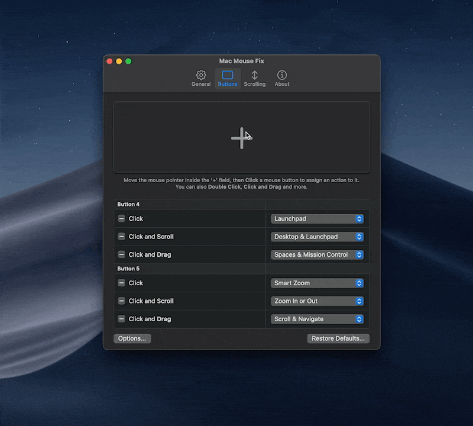

<!--
THIS FILE IS AUTOMATICALLY GENERATED - EDITS WILL BE OVERRIDDEN
-->
<table align="center"><td align="center">

Tento dokument je přeložen do jazyka `98%`
[Pomoc s překladem](https://redirect.macmousefix.com/?locale=cs&target=mmf-localization-contribution)</td></table>

<details>
<summary>󠁧󠁿🇨🇿 Čeština</summary>

  [🇬🇧 English](../../../Readme.md)\
  [🇩🇪 Deutsch](../../../Markdown/LocalizedDocuments/de/Readme.md)\
  [🇪🇸 Español](../../../Markdown/LocalizedDocuments/es/Readme.md)\
  [🇳🇴 Norsk bokmål](../../../Markdown/LocalizedDocuments/nb/Readme.md)\
  [🇧🇷 Português (Brasil)](../../../Markdown/LocalizedDocuments/pt-BR/Readme.md)\
  [🇹🇷 Türkçe](../../../Markdown/LocalizedDocuments/tr/Readme.md)\
  **🇨🇿 Čeština**\
  [🇷🇺 Русский](../../../Markdown/LocalizedDocuments/ru/Readme.md)\
  [🇺🇦 Українська](../../../Markdown/LocalizedDocuments/uk/Readme.md)\
  [🇨🇳 中文 (简体)](../../../Markdown/LocalizedDocuments/zh-Hans/Readme.md)\
  [🇯🇵 日本語](../../../Markdown/LocalizedDocuments/ja/Readme.md)\
  [🌎 Pomozte s překladem!](https://redirect.macmousefix.com/?locale=cs&target=mmf-localization-contribution)
</details>

  <!-- This README is greatly inspired by / stolen from sindresorhus/Gifski and sindresorhus/caprine -->

  <!-- ||| Ideas / Unused / Comments ||| -->

  <!-- 

    Section ideas: 
    - 

    Steal from these READMEs:
    - https://github.com/exelban/stats
    - sindresorhus/Gifski
    - sindresorhus/caprine

    Centered screenshot:
    ````
    <div align="center"></div>
    ````

    Link section with pipe-symbols instead of html table:
    ```
    <h3 align="center">
    <a href=https://macmousefix.com/>Download</a> |
    <a href=https://github.com/noah-nuebling/mac-mouse-fix/releases>Releases</a> |
    <a href=>Help &  Feedback</a>
    </h3>
    ```

  -->

  <!-- ||| Head Section ||| -->

  <!--
    <table align="center"><td>
    You can now test the <a href="https://github.com/noah-nuebling/mac-mouse-fix/releases/">Mac Mouse Fix 3 Beta!</a>
    </td></table>
  -->

<br>

<div align="center">
    <a href="https://macmousefix.com/">
        
    </a>
    <h1>Mac Mouse Fix</h1>  
    <p>Udělejte si z myši za 10 dolarů lepší nástroj než je trackpad od Apple!</p>
</div>

<br>
<br>

<div align="center">
    <table>
        <th><a href=https://macmousefix.com/>Website&nbsp;↗</a></th>
        <td><a href=https://redirect.macmousefix.com/?locale=cs&target=mmf-help-and-feedback>Nápověda&nbsp;&amp;&nbsp;Zpětná vazba</a></td> <!-- Note: Should probably use direct link instead of redirection-service: https://github.com/noah-nuebling/mac-mouse-fix/issues/new/choose -->
        <td><a href=https://redirect.macmousefix.com/?locale=cs&target=mmf-releases>Verze</a></td> <!-- Note: Should probably use direct link instead of redirection-service: https://github.com/noah-nuebling/mac-mouse-fix/releases -->
        <td><a href="Acknowledgements.md">Poděkování</a></td>
    </table>
    
</div>

<br>
<br>
<br>
<br>
  <!--Use this extra br when theres text above the first header (Edit: I think by "first header" I meant the h1 saying "Mac Mouse Fix", but not sure) -->
  <!-- <br> -->

  <!-- ||| Intro Text ||| -->

Mac Mouse Fix je aplikace, která vylepšuje vaši myš.

Chci z Mac Mouse Fix udělat nejlepší ovladač myši *všech dob*! Některé funkce v tuto chvíli stále chybí, ale myslím, že v některých ohledech už **mění běžné myši na nejlepší vstupní zařízení pro Macy**. Na stejné úrovni, nebo dokonce lepší, než Apple Trackpad nebo myš Logitech MX Master.

Další informace o tom, jak přesně Mac Mouse Fix vylepšuje vaši myš, naleznete na [webové stránce](https://macmousefix.com/).

  <!--
    easy, efficient, natural and pleasant
    Better than an Apple Trackpad or a Logitech MX Master. (These are often considered some of the best input devices for Macs)

    It offers amazingly natural and polished gestures and smooth scrolling that let you breeze through macOS just like an Apple Trackpad.

    It lets you do almost anything right from your mouse with its powerful customization options that are so simple and intuitive that anyone can use them.
  -->

<!-- 
  Note: We make these anchor links (`<a name="somename"></a>`) non-localizable, so that we can link to a specific section of the document in a language-agnostic way. 
    Example: 
      Linking into the German document with `https://github.com/noah-nuebling/mac-mouse-fix/blob/master/Markdown/LocalizedDocuments/de/Readme.md#macos-compatibility`
      will work, even though the `## macOS compatibility` header is localized to `## macOS Kompatibilität` in German. If we didn't have the anchor links, we'd have to localize the link itself `[...]/LocalizedDocuments/de/Readme.md#macos-kompatibilität` - that's the problem that the anchor links solve.
    Other:  
      #macos-compatibility is called a 'url fragment identifier'
-->

<a name="features"></a> 
## Funkce

Přehled funkcí Mac Mouse Fix, včetně videoukázek, naleznete na [webové stránce](https://macmousefix.com/#trackpad)!

Další podrobnosti naleznete v [Verzích](https://github.com/noah-nuebling/mac-mouse-fix/releases).

  <!--
    Major features were introduced in these versions:

    [0.9](https://github.com/noah-nuebling/mac-mouse-fix/releases/tag/0.9.0)
    | [1.0.0](https://github.com/noah-nuebling/mac-mouse-fix/releases/tag/1.0.0)
    | [2.0.0](https://github.com/noah-nuebling/mac-mouse-fix/releases/tag/2.0.0)
    | [2.1.0](https://github.com/noah-nuebling/mac-mouse-fix/releases/tag/2.1.0)
    | 3.0.0
  -->

<a name="installation"></a>
## Instalace

Stáhněte si nejnovější verzi Mac Mouse Fix na [webové stránce](https://macmousefix.com/).

Mac Mouse Fix můžete také nainstalovat pomocí [Homebrew](https://brew.sh/)! Stačí do terminálu zadat následující příkaz:

```bash
brew install mac-mouse-fix
```

Starší verze Mac Mouse Fix si můžete stáhnout v sekci [Verze](https://github.com/noah-nuebling/mac-mouse-fix/releases).

<a name="macos-compatibility"></a>
## Kompatibilita s macOS

Nejnovější verze Mac Mouse Fix je určena pro **macOS 11 Big Sur** nebo novější.

Pokud používáte macOS **10.15 Catalina**, macOS **10.14 Mojave** nebo macOS **10.13 High Sierra**, můžete použít [nejnovější verzi Mac Mouse Fix 2](https://redirect.macmousefix.com/?locale=cs&target=mmf2-latest). Mac Mouse Fix 3.0.0 a novější mohou na vašem počítači stále fungovat, ale budou mít vizuální problémy a některé funkce nemusí fungovat správně.

Pokud používáte macOS **10.12 Sierra** nebo **10.11 El Capitan**, můžete použít Mac Mouse Fix [2.2.0](https://github.com/noah-nuebling/mac-mouse-fix/releases/tag/2.2.0) nebo starší verzi.

<a name="pricing"></a> 
## Ceny

Přehled cen pro Mac Mouse Fix 3 naleznete na [webové stránce](https://macmousefix.com/#price).<br>
Mac Mouse Fix 2 a starší verze zůstanou navždy zdarma.

<a name="uninstallation"></a> 
## Odinstalace

Aplikaci Mac Mouse Fix odinstalujete jednoduše přesunutím do koše.

V systému však zůstanou soubory. Chcete-li se těchto souborů zbavit, doporučuji skvělý program [AppCleaner od FreeMacSoft](https://freemacsoft.net/appcleaner/).

V systému macOS není možné, aby aplikace tyto zbývající soubory samy odstranily, když ji smažete. Proto důrazně doporučuji používat aplikaci, jako je AppCleaner.

<a name="what-people-say"></a> 
## Co říkají lidé

Moc děkujeme všem, kteří se s námi podělili o své nadšení z Mac Mouse Fix!<br>
Na [webové stránce](https://macmousefix.com/) najdete sbírku hezkých věcí, které lidé o aplikaci napsali.

  <!-- 
    These cool articles were written about MMF

    - That YouTube video (so sick)
    - Lifehacker
    - Blib blob (Japanese)
    - Not CNET review
    - (?If you know about other coverage of MMF let me know?) 
  -->

<a name="tips"></a> 
## Tipy

- **Spravujte okna jednoduchým kliknutím a tažením**

  [Swish](https://highlyopinionated.co/swish/) je můj nejoblíbenější způsob správy oken v systému macOS. Jednoduchým přejetím prstem po trackpadu můžete umístit libovolné okno tak, aby zabíralo polovinu, čtvrtinu nebo celou obrazovku.
  
  Swish je určen pro gesta na trackpadu, ale s Mac Mouse Fix ho můžete používat z jakékoli myši třetí strany! Stačí přejít do Mac Mouse Fix a nastavit akci 'Kliknutí a tažení' libovolného tlačítka na 'Posouvání a navigace' a poté můžete okna přitahovat jednoduchým kliknutím a tažením.
  
  Všechno, co můžete dělat přejetím dvěma prsty po trackpadu Apple, funguje stejně dobře s funkcí 'Posouvání a navigace' v Mac Mouse Fix.

- **Ovládejte jas obrazovky, hlasitost zvuku nebo přehrávání médií přímo pomocí myši**

  Mac Mouse Fix vám umožňuje používat **libovolnou klávesu na klávesnici** přímo z myši – dokonce i speciální klávesy, které se nacházejí pouze na klávesnicích Apple a umožňují ovládat jas obrazovky, hlasitost zvuku, přehrávání médií a další.
  
  Pokud nemáte po ruce klávesnici Apple, **podržte klávesu Option (⌥)** a vyberte speciální klávesy Apple.

  

<a name="questions"></a> 
## Dotazy

- Je Mac Mouse Fix nativní na Apple Silicon?
    
  Yes, Mac Mouse Fix runs 100% native on Apple Silicon.

- **Proč je při kliknutí zpoždění?**

  Po kliknutí může Mac Mouse Fix počkat, zda kliknete dvakrát.<br>
  Chcete-li zpoždění tlačítka odstranit, smažte pro dané tlačítko všechny akce 'Dvojité kliknutí'.

<!--
  <<< [Sep 2025] Commenting this out because we moved this info into CapturedButtonsMMF3.md - maybe we should link to it here? >>>

- {{**How can I orbit around objects in 3D apps like Blender?**||questions.blender||}}

  ```
  key: questions.blender.body
  ```
  In 3D apps like Blender, you normally Click and Drag the Middle Mouse Button to orbit around objects.<br>
  But if you assign actions to the Middle Mouse Button in Mac Mouse Fix, then this won't work anymore.
  
  To solve this, I know of 2 options:
  1. Assign clicking and dragging one of the buttons of your mouse to the "Scroll & Navigate" feature. This feature simulates swiping with 2 fingers on an Apple Trackpad. This will, among other things, let you orbit in 3D apps! 
  2. *Uncapture* the Middle Mouse Button by deleting all actions assigned to it in Mac Mouse Fix. See [this guide](https://redirect.macmousefix.com/?target=mmf-captured-buttons-guide) for more info.
  ```
  comment: 
  ```
-->
- **Mohu otevřít aplikaci App Exposé pomocí gesta kliknutí a tažení?** <!-- Note: We're using App Exposé here and Application Windows in MMF. Not sure that's great. I felt this was clearer though. -->

  Ano! Stačí vybrat akci 'Plocha a Mission Control' a poté kliknout a přetáhnout *dolů*.
  
  Pokud to nefunguje, je to pravděpodobně proto, že gesto trackpadu 'App Exposé' je na vašem Macu zakázáno.<br>
  Gesto můžete povolit v Nastavení systému nebo spuštěním následujícího příkazu v terminálu:
  
  ```
  defaults write com.apple.Dock showAppExposeGestureEnabled -bool TRUE; killall Dock
  ```
  
    <!-- ^^^ NOTES: Maybe we should automate this. For context, see Issue https://github.com/noah-nuebling/mac-mouse-fix/issues/387 -->

- Existují 'Nastavení specifická pro aplikaci' nebo 'Profily'?
  
  V Mac Mouse Fix 2 můžete **zakázat funkce jako plynulé posouvání** v sekci `Více... > Nastavení specifická pro aplikace`.
  
  V Mac Mouse Fix 3 tato funkce zatím neexistuje. <br>
  Plánuji jak 'nastavení specifická pro aplikace', tak i 'nastavení specifická pro myš', ale zatím nemám časový harmonogram, kdy budou vydány.
  
  **Tip:** Dokud v Mac Mouse Fix 3 nebudou 'nastavení specifická pro aplikace', můžete provést toto:
  - Otevřete kartu `Obecné`
  - Zapněte `Zobrazit v panelu nabídek`
  - Nyní můžete **zakázat funkce jako plynulé posouvání** přímo z panelu nabídek
  
  Také by mě zajímalo, jaký je váš *případ použití*. Neváhejte odeslat [požadavek na funkci](https://redirect.macmousefix.com/?locale=cs&target=mmf-feedback-feature-request). Váš názor pomůže funkci co nejlépe vylepšit, jakmile bude k dispozici.
  <!-- ^^^ It's not a perfect solution, but I hope it helps a little until app-specific settings arrive. -->
  <!-- ^^^ Note: Us having to explain points at a bit of a UX failure I think. -->

- **Je moje myš podporována?**

  Pravděpodobně. Pokud si chcete být jisti, je nejlepší si stáhnout Mac Mouse Fix a vyzkoušet ho.
  
  Mac Mouse Fix funguje velmi dobře s většinou myší. U některých myší určených pro použití s ​​proprietárním ovladačem, jako je Logitech Options, však Mac Mouse Fix v tuto chvíli nedokáže rozpoznat všechna tlačítka.
  
  Je to proto, že tyto myši komunikují s počítačem pomocí speciálního proprietárního protokolu namísto standardního protokolu USB.
  
  Rád bych někdy pro tyto myši přidal plnou kompatibilitu, ale je to spousta práce a brzy to nebude.

- **Některá tlačítka na mé myši nejsou rozpoznána**

  Viz otázka **'Je moje myš podporována?'** výše.

- **Je Magic Mouse podporována?**

  V budoucnu bych mohl přidat funkce, které vylepší Apple Magic Mouse, ale v současné době na to Mac Mouse Fix nemá žádný vliv.
  
    <!-- You can use SteerMouse or proprietary driver like Logitech Options instead. -->


    <!--
      - **How many buttons should my mouse have?**

        To get the best experience I recommend using Mac Mouse Fix with a mouse that has at least 5 buttons. If your mouse has fewer than 5 buttons, Mac Mouse Fix still provides rich functionality and a great experience, but some features will be less easy to access compared to a 5-button mouse. With a 5-button mouse, you can really breeze through macOS in a way that's just as nice as an Apple Trackpad!
        
        To learn more, see the [trackpad section](https://macmousefix.com/#trackpad) on the website.


      - **Mouse brands**

        I'm not the biggest expert on mouse hardware, but I do have quite a collection now, thanks to my work on Mac Mouse Fix! If I had to make a recommendation for what mouse to buy for the best experience with Mac Mouse fix, I'd say get a smaller, chinese brand on Amazon. In my experience, these mice often have better build quality at a fraction of the price of a big brand mouse like Logitech or Roccat. Also, some models of bigger manufacturers like Logitech are made to be used with their proprietary driver software, and they won't be fully compatible with Mac Mouse Fix. If you buy a smaller brand, you can usually be sure, that they will work flawlessly with non-proprietary drivers like Mac Mouse Fix.
    -->

- **Jsou podporována naklápěcí rolovací kolečka?**

  Některé myši umožňují nakloněním kolečka doleva nebo doprava pro horizontální posouvání. Mac Mouse Fix zajistí přirozenější a snadnější ovládání. V současné době však není možné nakloněním kolečka spouštět jiné akce, jako je přepínání mezi plochami. Rád bych tuto funkci někdy implementoval, ale je to spousta práce a brzy nebude k dispozici.
  
    <!-- This is so hard, because it would require reprogramming the mouse so that it sends button-signals instead of sending scroll-signals, when you tilt the scroll wheel. And to reprogram the mouse, would require communicating with the it through the custom vendor-specific protocol. And that's not easy. For many mice it's not even possible. -->

- **Vypnutí zrychlení ukazatele**

  Mac Mouse Fix neumožňuje vypnout zrychlení ukazatele, ale pokud používáte **macOS 14 Sonoma** nebo novější, můžete zrychlení ukazatele vypnout v sekci `Nastavení systému > Myš > Upřesnit... > Zrychlení ukazatele`.
  
  V budoucnu plánuji přidat opravdu skvělé způsoby, jak zrychlení ukazatele vylepšit, ale nejsem si jistý, kdy to bude.

- **Jaký je rozdíl mezi Mac Mouse Fix 2 a 3?**
  
  **Monetizace:** <br>
  Mac Mouse Fix 2 je 100% zdarma a plánuji ho i nadále podporovat. <br>
  Mac Mouse Fix 3 je 30 dní zdarma, poté stojí pár dolarů.
  
  
  **Funkce:** <br>
  Zde je [srovnání funkcí](https://redirect.macmousefix.com/?locale=cs&target=mmf-version-2-vs-3). Napsal jsem ho krátce po vydání Mac Mouse Fix 3 – takže může být mírně zastaralé. <br>
  Můžete si také zdarma stáhnout Mac Mouse Fix [2](https://redirect.macmousefix.com/?locale=cs&target=mmf2-latest) a [3](https://macmousefix.com/) a sami si je otestovat!

- **Shromažďuje Mac Mouse Fix moje data?**

  Mac Mouse Fix neobsahuje reklamy a neshromažďuje o vás žádné osobní údaje.
  
  V okamžiku, kdy si aplikaci zakoupíte, však prodejce Gumroad.com shromažďuje některé osobní údaje, jako je vaše e-mailová adresa, a tyto údaje jsou viditelné pro mě. To je nezbytné pro vrácení peněz, zaslání licenčního klíče na váš e-mail atd. Tuto funkci nemohu vypnout. Chcete-li se dozvědět více o datech shromažďovaných při zakoupení Mac Mouse Fix, přečtěte si [Zásady ochrany osobních údajů Gumroad](https://gumroad.com/privacy).

- **Na kolika zařízeních mohu licenci použít?**
  
  Vaše licence funguje na **všech vašich Macích**. <br>
  Cílem je, abyste si mohli licenci jednoduše koupit, aktivovat ji a už se o ni nikdy nemuseli starat. <br>
  Pokud se přihlásíte se stejným účtem Apple, licence se dokonce automaticky synchronizuje s vašimi ostatními zařízeními přes iCloud!
  
  
  Pokud narazíte na problémy s aktivací licence, můžete mi [poslat e-mail](https://redirect.macmousefix.com/?locale=cs&target=mailto-noah). <br>
  
  Někdy mi odpověď trvá déle. Omlouvám se. Ale ozvu se vám!
  
  
  Existuje jedno omezení: <br>
  
  Licence nejsou určeny k veřejnému sdílení. Jedna licence je určena pro jednu osobu. Veřejně sdílené licence mohou být zneplatněny. (Sdílení s Vaší mamkou je v pořádku!)

  <!-- ^^^ Note: ChatGPT tells me I should mention that ppl can still use the license after they *upgrade* to a new device. Don't think that's necessary -->
  <!-- ^^^ TODO: Consider linking / copying this on the (Gumroad) checkout page. Ppl may not find it here. -->

- **Bude moje licence fungovat i s budoucími verzemi?**
   
  Vaše licence se vztahuje na všechny verze Mac Mouse Fix 3.x.
  
  Budoucí verze, například 4.0, mohou vyžadovat nový nákup, ale pokusím se tomu vyhnout, pokud to nebude nutné k podpoře dalšího vývoje aplikace.

- **Existují nějaké podmínky pro vrácení peněz?**

  Neexistují žádné oficiální podmínky pro vrácení peněz, ale aplikace je 30 dní zdarma.
  
  Pokud po zakoupení aplikace narazíte na nějaké problémy, kontaktujte mě a já se vám budu snažit co nejlépe pomoci.

- **Bude Mac Mouse Fix i po monetizaci stále open source?**

  Ano, Mac Mouse Fix bude i nadále open source!
  
  Vyzývám každého, aby používal zdrojový kód Mac Mouse Fixu ve svých vlastních projektech, pokud nevydá jen jeho jednoduchou kopii.
  
  Podrobnosti naleznete v licenci [MMF License](https://github.com/noah-nuebling/mac-mouse-fix/blob/master/License), pod kterou je Mac Mouse Fix 3 a novější licencován.

    <!--
      , and I don't plan to change that at any point.
    
      This also means you can use Mac Mouse Fix for free by building it from source and disabling the licensing checks. That's perfectly fine, I just discourage sharing these cracked versions online.<br>
      And of course, on the next update, you'll get a non-cracked version which means you'll have to do this again for every update. (Or just pay $1.99 for the greatest mouse driver ever! :)
    -->

- **Mohu získat opravu myši Mac zdarma, když jsem již daroval/a?**

  Ano! Pokud jste darovali přes PayPal, klikněte [sem](https://redirect.macmousefix.com/?locale=cs&target=mmf-apply-for-milkshake-license) a získejte **bezplatnou licenci**.

<!--

>>> [Jun 2025] These questions are super rare – I think I just added it here cause I find it interesting.
      ... If we ever wanna add these commented-out sections, we should probably edit them and make sure the links are correct and localized, too.


- **Will there be an iPad or Windows version of the app?** 

  That would be really cool, but it's not coming any time soon. iPad is currently lacking the necessary APIs, and either way I'd have to rewrite most of the app, which would take a lot of time. For now, I'm focused on making the macOS version as great as possible.

  (I wrote more about this [here](https://github.com/noah-nuebling/mac-mouse-fix/issues/1437))

-->

<!--

>>> [Jun 2025] People will email me anyways, this doesn't really add anything I think.

- **I can't pay for the app. What can I do?** 

  I want Mac Mouse Fix to be accessible to everyone. If you can't pay for the app due to regional restrictions or any other reason, please [send me an email](https://redirect.macmousefix.com/?locale=cs&target=mailto-noah). Unfortunately, it may take me a while to answer, but I will get back eventually, and work on finding a solution.

-->

<!--

 >>> [Jul 2025] The fact that ppl continue to be confused about this is kind of a UX failure. This explanation shouldn't be necessary. I tweaked the UI text and hope it's better now.

- **Why does the Mac Mouse Fix window open when I start my Mac?** 

  This is likely because you've set Mac Mouse Fix as a macOS Login Item. Please see [Apple's Guide](https://support.apple.com/en-me/guide/mac-help/mh15189/mac) on how to manage Login Items. 
  
  Mac Mouse Fix works differently from many other apps. Once the 'Enable Mac Mouse Fix' switch is turned on, the app continues to affect your mouse even after you close the app or restart your computer. This means you don't need to add it as a Login Item to keep it working.

  **Background Info**

  This works because your mouse is not directly affected by the 'Mac Mouse Fix' app, but instead by the 'Mac Mouse Fix Helper' process, which runs in the background as long as the 'Enable Mac Mouse Fix' switch is turned on.

-->

<!--
>>> [Jun 2025] Commenting this out cause it's rare, and it's a stopgap measuere, and it' too much work to make good rn. Also, the scroll-uncapture notifications in feature-strings-catalog might clear up this confusion. Might re-enable if ppl continue to be confused. But perhaps, the 'how to stop MMF from intercepting Scroll / Buttons' stuff should be its own section. Sloppily wrote this, needs more editing <<<

- **Why do the 'Scrolling' and 'Buttons' items in the Menu Bar get re-enabled?**
    
  The Menu Bar buttons are meant to quickly, and temporarily turn off certain features while you're working in incompatible apps. 
  This is intended as a stop-gap-measure while there's no 'App-Specific Settings' feature, yet. <br>
  Curently the UI would break if these are enabled, so when you open the Buttons tab or Scrolling tab, they get toggled and stuff.
  To edit the settings in a permanent way, you can edit the settings in 'Buttons' and 'Scrolling' Tab. 
  
  To completely turn off all effects of Mac Mouse Fix on your buttons, delete all the actions on the 'Buttons' tab. <br>
  To completely turn off all effects of Mac Mouse Fix on your scroll wheel, configure the 'Scrolling' tab like this:
  <Insert screenshot>
  
  I know the current solution isn't amazing. But it allowed me to ship MMF 3.
  I plan to eventually replace the buttons in the Menu Bar with powerful App-Specific Settings. 
-->

<a name="how-you-can-contribute"></a> 
Ano! Pokud jste darovali přes PayPal, klikněte [sem](Acknowledgements.md) a získejte **bezplatnou licenci**.

  <!--
    - **Spreading the word**

      If you simply talk about Mac Mouse Fix on the internet or elsewhere, that is very helpful for the project.

  -->

- **Poskytnutí zpětné vazby**
    
  Můžete pomoci sdílením svých **nápadů**, **problémů** a **zpětné vazby** prostřednictvím [Asistenta pro zpětnou vazbu](https://noah-nuebling.github.io/mac-mouse-fix-feedback-assistant/?type=bug-report).

- **Finanční příspěvky**
  
  Doufám, že se díky Mac Mouse Fixu budu moci finančně uživit. Takto se můžu aplikaci dále zlepšovat a pracovat na ní. Pokud byste chtěli pomoci, můžete:
  1. Koupit Mac Mouse Fix kliknutím na tlačítko v aplikaci nebo kliknutím [sem](https://noahnuebling.gumroad.com/l/mmfinappusd).
  2. [Dat mi spropitné](https://www.paypal.com/cgi-bin/webscr?cmd=_s-xclick&hosted_button_id=ARSTVR6KFB524&source=url&lc=en_US) na PayPalu. Nemám z toho moc peněz, ale vždycky je roztomilé a motivující získat dar.
  3. [Sponzorovat mě](https://github.com/sponsors/noah-nuebling) na GitHubu. Měsíční sponzorství je skvělý způsob, jak podpořit projekt a pomoci mi mít stabilnější příjem.

- **Přidávání překladů**
  
  Mac Mouse Fix je k dispozici v angličtině, němčině a také v jazycích uvedených v [Poděkování](Acknowledgements.md).
  
  Pokud byste chtěli **pomoci s překladem projektu**, podívejte se na [Průvodce překladem](https://redirect.macmousefix.com/?target=mmf-localization-contribution).<br>
  Pokud chcete **nahlásit chybějící nebo neoptimální překlady**, je to také velmi užitečné. Nejlepší způsob, jak nahlásit problémy, je zanechat komentář v [Průvodci překladem](https://redirect.macmousefix.com/?target=mmf-localization-contribution).

- **Pomoc s kódováním**

    <!-- 
      Old note from contributing.code.body:
      I should mention people who contributed code on the acknowledgements page. They are already in the update notes. 
    -->

  Pokud byste chtěli přispět kódem, to je skvělé! Budu rád za jakékoli [pull requesty](https://github.com/noah-nuebling/mac-mouse-fix/pulls).
  
  Nicméně nemusím přijmout všechny pull requesty. Pokud chcete mít jistotu, že vaše práce nepřijde nazmar, můžete odeslat počáteční pull request, který pouze *popisuje* změny, které chcete provést, ale obsahuje málo nebo žádný kód. Pak vám můžu poskytnout zpětnou vazbu a říct vám, zda bych změny, které chcete provést, tímto způsobem přijal.

**Děkuji** všem, kteří mě již přispěli a podpořili ve snaze vytvořit nejlepší ovladač myši *všech dob*! :)🚀
