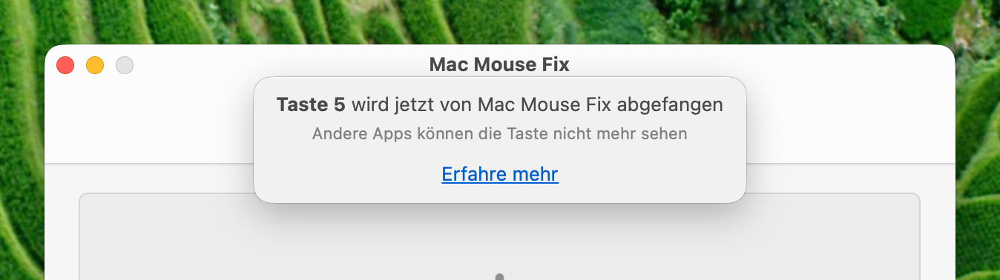
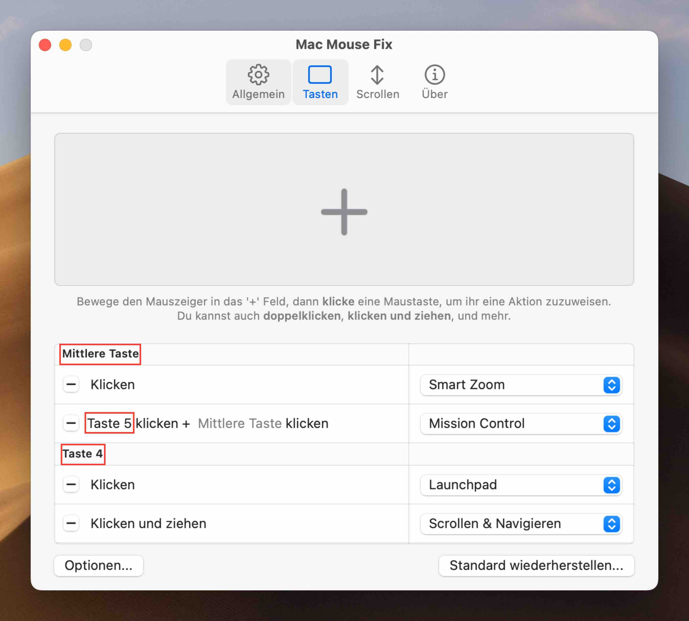
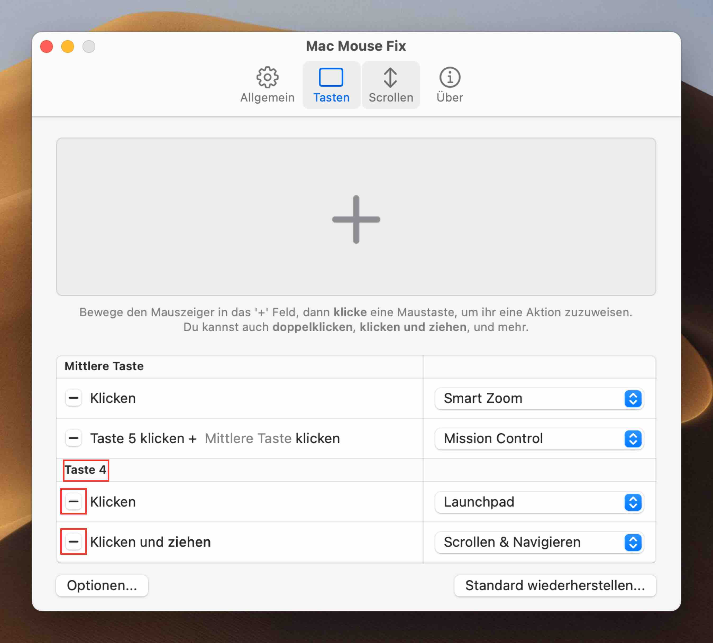

<!--
THIS FILE IS AUTOMATICALLY GENERATED - EDITS WILL BE OVERRIDDEN
-->

󠁧󠁿🇩🇪 Deutsch

  [🇬🇧 English](../../../../../Support/Guides/CapturedButtonsMMF3.md)\
  **🇩🇪 Deutsch**\
  [🇨🇿 Čeština](../../../../../Markdown/LocalizedDocuments/cs/Support/Guides/CapturedButtonsMMF3.md)\
  [🇷🇺 Русский](../../../../../Markdown/LocalizedDocuments/ru/Support/Guides/CapturedButtonsMMF3.md)\
  [🌎 Beim Übersetzen helfen!](https://redirect.macmousefix.com/?locale=de&target=mmf-localization-contribution)

<!--

Planning for updated MMF 3 Captured Buttons Guide: [Aug 2025]

- There are two aspects to the Guide:
    - Practical user problems caused by capturing
        - Helping people solve these are the core purpose of this Guide
        - List of practical problems I can think of
            - Terminal pasting, Browser-link-opening 
                - (Due to Middle Click capturing)
            - Blender orbiting 
                - (Due to Middle Drag capturing)
            - Browser back-and-forward 
                - (Due to Side-Button Capturing) 
                - (I don't remember actually hearing issue reports about this.)
            - Video-game remapping of side-buttons 
                - (Due to Side-Button Capturing) 
                - (Which videogames do that?)
            - Using MOS, Logi Options, or another smooth scrolling app for scrolling, and using MMF only for buttons
                - (Due to scrollwheel capturing) 
                - (Not sure if you need to fully uncapture to make this work – Can't you just turn off smooth-scrolling in MMF? But it would still be nice for users to know how to get MMF CPU usage during scrolling to 0% if they don't need it.)
    - Instilling fundamental mental model of how capturing works
        - If people understand this, they can then understand how to solve their specific practical problems. Maybe even ones we're not aware of.
        - This may make up the majority of the content, but it's **in service** of people being able to solve the practical problems.

Content:
    - Core explanation of 'capturing' 
        - should probably be shared for scrollwheel and buttons
        - ... But that might make it more abstract and harder to understand? 
    - Practical UI-based guides 'How do I know what is captured' and 'how to uncapture' 
        - should probably be specific to scrollwheel / buttons and should probably use screenshots so it's very easy-to-follow
    - Reference to practical problems (See above)
        - People with those practical problems should be naturally guided to this article and it should be clear that they need to read this to sole the problem.
            - Leading with the abstract explanations of what 'capturing' means might not make this obvious?
                - Maybe list the practical issues explicitly in a scannable way.
            - Think about the 'user journey' for people with those practical problems!
        - Also write about how people can solve those practical issues caused by capturing *without* uncapturing (e.g. Middle Click action, Scroll & Navigate for Orbiting, etc.)
            - I guess you could think of uncapturing as a bit of a nuclear/last resort option (?) (but useful to understand)
        - Probably pull in the Blender Orbiting section from Readme > Questions
            - Are there other sections we should pull in?
-->

<!-- 
    Philosophical: The current draft explains the reasoning and addresses the problem cases I'm aware of in great detail. The old version just tried to instill fundamental understanding of capturing and let users figure out their usecases (and mentions some problem-cases briefly at the end to say "here's how to solve this without uncapturing")

    Update: [Sep 2025] It seems we since went back to something closer to the old structure.

        New Philosophical thoughts: I think I program too much. I was too in my head with this. This isn't about making some technically perfect thing, it's just about helping people solve problems with the app.
-->

<!-- 

-->

<!--

# Captured Buttons

When you install Mac Mouse Fix, you'll notice that the **buttons on your mouse perform new functions**.

However, you may also notice that, some of the old **functions that those buttons used to perform no longer work**.

This may disrupt your workflow, if you previously used the buttons to:

- Click and Drag the middle button to **Orbit around objects in 3d modeling apps like Blender.**
- Click the middle button to **paste text in the Terminal**
- Click the middle button to **open links in a new tab in Safari and other browsers**
    - Click the middle button to **close tabs in Safari and other browsers**. 
        (Is this worth mentioning separately?)
- Click the side buttons (mouse button 4 and 5) to **go back and forward in Chrome, VSCode, and other apps.**
- Remapped the mouse buttons to **Custom assigned functions in video games or pro apps** (like ...? VSCode?).

The buttons will no longer perform their usual actions because the buttons have been **captured** by Mac Mouse Fix – that means Mac Mouse Fix takes **complete control** of those buttons and **other apps no longer get notified** when you press those buttons. (/ "can no longer see" those buttons.) 

Mac Mouse Fix needs to hide the button from other apps so that you can perform gestures and actions in Mac Mouse Fix without accidentally triggering functions on those other apps at the same time.

## What can I do to restore the functionality of a button before it was captured by MMF?

To get back the functionality that you were used to before installing Mac Mouse Fix, there are 3 approaches.

1. Leave the Button captured, but assign functionality inside MMF that restores the original functionality that you were used to.
2. Uncapture the button – if you delete **all the bindings** in MMF for a button, then that button will no longer be captured and will behave exactly as if Mac Mouse Fix was disabled
3. Disable Mac Mouse Fix entirely (Switch off `General > Enable Mac Mouse Fix`) – then MMF will not interfere with the functioning of your mouse at all.

### 1. Restoring old functionality – without uncapturing

 - Assign Click and Drag to 'Scroll & Navigate'. It will simulate trackpad-swiping with 2 fingers which lets you orbit in Blender among other things. However if your computer getting slow this might become less responsive (Working on that.)
    Solves usecases: 
        - **Orbit around objects in 3d modeling apps like Blender.**
        - **go back and forward in Chrome, VSCode, and other apps.**
- Assign Clicking to 'Middle Click' action in MMF.
    Solves usecases: 
        - **paste text in the Terminal**
        - **open links in a new tab in Safari and other browsers** 
            - and **close tabs in Safari and other browsers**
        - **Custom assigned functions in video games or pro apps**
            - Caveats: Only 'click' actions will work, not 'Click and Drag' actions – because MMF sends the mouseup and mousedown event at once. (Necessary to avoid interference with other MMF gestures assigned to the same button)
- Assign clicking to 'Back' and 'Forward' actions in MMF
    Solves usecases:
        - **go back and forward in Chrome, VSCode, and other apps.**
        - **Custom assigned functions in video games or pro apps**
            - Why this works? The 'Back' and 'Forward' actions will actually simulate MB 4/5 clicks in video games and pro apps (since MMF 3.0.6), so you can then remap MB 4/5 in those games/apps and it'll work.
            - Caveats: Only 'click' actions will work, not 'Click and Drag' actions – because MMF sends the mouseup and mousedown event at once. (Necessary to avoid interference with other MMF gestures assigned to the same button)

### 2. Restoring old functionality – by uncapturing

(Maybe insert the explanations of the fundamental capturing concepts from the old guide.)

-->

# Abgefangene Maustasten

Beim Verwenden von Mac Mouse Fix, bist du vielleicht schonmal auf eine Nachricht gestoßen, die besagt, dass eine Taste deiner Maus jetzt von Mac Mouse Fix 'abgefangen' wird.

In diesem Artikel erfährst du, was das bedeutet, welche Probleme es auslösen kann, und wie du mit ihnen umgehen kannst.

## Was bedeutet 'abfangen' einer Maustaste?

Eine Maustaste, die von Mac Mouse Fix abgefangen wird, kann von anderen Apps und von macOS nicht mehr gesehen werden.
Die Funktionen, die diese Taste normalerweise ausführen würde, funktionieren nicht, solange sie abgefangen wird.

**Beispiel**: Normalerweise kann man in Chrome Vor und Zurück gehen, indem man die Seitentasten (Taste 4 und 5) der Maus klickt.
Doch wenn die Seitentasten von Mac Mouse Fix abgefangen werden, dann funktioniert das nicht mehr. Stattdessen lösen die Seitentasten dann nur noch die Aktionen aus, die du ihnen in Mac Mouse Fix zugewiesen hast.

**Warum macht Mac Mouse Fix das?** Mac Mouse Fix versteckt Tasten vor anderen Apps, damit du beim Verwenden von Mac Mouse Fix Gesten nicht aus Versehen auch gleichzeitig andere Funktionen auslöst. 
Wenn du z.B. Taste 4 klickst und ziehst um zwischen Schreibtischen zu wechseln, dann würdest du auch immer **gleichzeitig** eine Seite in Chrome zurückgehen.

## Woher weiß ich, welche Tasten von Mac Mouse Fix abgefangen werden?

Jede Taste, die links im 'Tasten'-Tab angezeigt wird, wird von Mac Mouse Fix abgefangen.

Im folgenden Bild werden die **'Mittlere Taste'**, **'Taste 5'** und **'Taste 4'** abgefangen:  

## Wie verhindere ich, dass Mac Mouse Fix eine Maustaste abfängt?

Um zu verhindern, dass Mac Mouse Fix eine Maustaste abfängt, lösche alle Einträge für diese Maustaste aus dem 'Tasten'-Tab.
Du kannst einen Eintrag im 'Tasten'-Tab löschen, indem du die '-' Taste links anklickst.

z.B. könnte man im folgenden Bild das Abfangen von **'Taste 4'** verhindern, indem man die beiden hervorgehobenen **'-'** Tasten anklickt:

## Wie kann ich die ursprüngliche Funktion einer Taste wiederherstellen?

Damit sich eine Taste wieder so verhält, wie bevor du Mac Mouse Fix installiert hast, kannst du:

1. Du kannst **verhindern, dass die Taste abgefangen wird** – so wie oben beschrieben.

2. Du kannst **Mac Mouse Fix** auch einfach **ausschalten** – dann werden keinerlei Tasten mehr abgefangen.

3. Du kannst **der Taste bestimmte Aktionen in Mac Mouse Fix zuweisen** – so kannst du bestimmte Funktionen wiederherstellen, *auch während die Taste abgefangen wird*:

| Taste | Ursprüngliche Funktion | Aktion in Mac Mouse Fix |
|----------|-----------------------------------|-------------------------|
| Mittlere Maustaste | Links im Browser in einem neuen Tab öffnen | 'Mittelklick' (Kann dem *Klicken* einer Taste zugewiesen werden) |
| Mittlere Maustaste | Text im Terminal einfügen | 'Mittelklick' (Kann dem *Klicken* einer Taste zugewiesen werden) |
| Maustaste 4 / Maustaste 5 | Zurück / Vorwärts gehen in Chrome und anderen Apps | 'Zurück' / 'Vorwärts' (Kann dem *Klicken* einer Taste zugewiesen werden) |
| Mittlere Maustaste | Um Objekte in Blender (und anderen 3D-Apps) kreisen | 'Scrollen & Navigieren' (Kann dem *Klicken und Ziehen* einer Taste zugewiesen werden) |

So kannst du weiter wie gewohnt die Taste verwenden, aber ihr gleichzeitig *zusätzliche* Funktionen in Mac Mouse Fix zuweisen!

## Siehe auch

- [Abgefangene Scrollräder](<../../Support/Guides/CapturedScrollWheels.md>)

 

<table align="center">
<td>

Ich hoffe diese Information war nützlich!</td>
<td>

Noch Fragen? Klicke [hier](https://redirect.macmousefix.com/?locale=de&target=mmf-support-still-have-questions).</td>
</table>

<!-- 
Should we add explanations / context for the table above?
- [ ] Maybe add screenshot of how to select the actions in MMF? (as in the MMF2 Guide.)
- [ ] Maybe explain how **'Zurück'** / **'Vorwärts'** simulate MB 4/5 clicks in third-party apps
- [ ] Maybe explain how **'Scrollen & Navigieren'** simulates 2-finger Trackpad swipes
-->

<!-- Hint: You can also assign the 'Middle Click' action to other any other trigger like 'Button 4 Hold' etc. Learn more about triggers in this guide -->