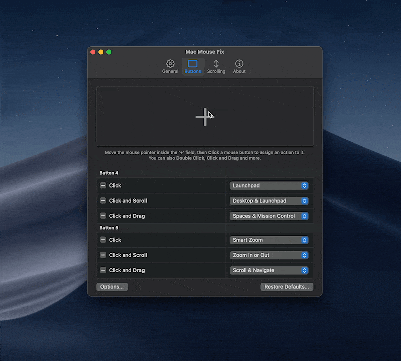

<!--
THIS FILE IS AUTOMATICALLY GENERATED - EDITS WILL BE OVERRIDDEN
-->
<details>
<summary>󠁧󠁿🇮🇹 Italiano</summary>

  [🇬🇧 English](../../../Readme.md)\
  [🇩🇪 Deutsch](../../../Markdown/LocalizedDocuments/de/Readme.md)\
  [🇪🇸 Español](../../../Markdown/LocalizedDocuments/es/Readme.md)\
  **🇮🇹 Italiano**\
  [🇳🇴 Norsk bokmål](../../../Markdown/LocalizedDocuments/nb/Readme.md)\
  [🇧🇷 Português (Brasil)](../../../Markdown/LocalizedDocuments/pt-BR/Readme.md)\
  [🇹🇷 Türkçe](../../../Markdown/LocalizedDocuments/tr/Readme.md)\
  [🇨🇿 Čeština](../../../Markdown/LocalizedDocuments/cs/Readme.md)\
  [🇷🇺 Русский](../../../Markdown/LocalizedDocuments/ru/Readme.md)\
  [🇺🇦 Українська](../../../Markdown/LocalizedDocuments/uk/Readme.md)\
  [🇨🇳 中文 (简体)](../../../Markdown/LocalizedDocuments/zh-Hans/Readme.md)\
  [🇯🇵 日本語](../../../Markdown/LocalizedDocuments/ja/Readme.md)\
  [🌎 Ti piacerebbe aiutarci a tradurre?](https://redirect.macmousefix.com/?locale=it&target=mmf-localization-contribution)
</details>

  <!-- This README is greatly inspired by / stolen from sindresorhus/Gifski and sindresorhus/caprine -->

  <!-- ||| Ideas / Unused / Comments ||| -->

  <!-- 

    Section ideas: 
    - 

    Steal from these READMEs:
    - https://github.com/exelban/stats
    - sindresorhus/Gifski
    - sindresorhus/caprine

    Centered screenshot:
    ````
    <div align="center"></div>
    ````

    Link section with pipe-symbols instead of html table:
    ```
    <h3 align="center">
    <a href=https://macmousefix.com/>Download</a> |
    <a href=https://github.com/noah-nuebling/mac-mouse-fix/releases>Releases</a> |
    <a href=>Help &  Feedback</a>
    </h3>
    ```

  -->

  <!-- ||| Head Section ||| -->

  <!--
    <table align="center"><td>
    You can now test the <a href="https://github.com/noah-nuebling/mac-mouse-fix/releases/">Mac Mouse Fix 3 Beta!</a>
    </td></table>
  -->

<br>

<div align="center">
    <a href="https://macmousefix.com/">
        
    </a>
    <h1>Mac Mouse Fix</h1>  
    <p>Rendi il tuo mouse da €10 migliore di un trackpad Apple!</p>
</div>

<br>
<br>

<div align="center">
    <table>
        <th><a href=https://macmousefix.com/>Sito web&nbsp;↗</a></th>
        <td><a href=https://redirect.macmousefix.com/?locale=it&target=mmf-help-and-feedback>Aiuto&nbsp;e&nbsp;feedback</a></td> <!-- Note: Should probably use direct link instead of redirection-service: https://github.com/noah-nuebling/mac-mouse-fix/issues/new/choose -->
        <td><a href=https://redirect.macmousefix.com/?locale=it&target=mmf-releases>Release</a></td> <!-- Note: Should probably use direct link instead of redirection-service: https://github.com/noah-nuebling/mac-mouse-fix/releases -->
        <td><a href="Acknowledgements.md">Riconoscimenti</a></td>
    </table>
    
</div>

<br>
<br>
<br>
<br>
  <!--Use this extra br when theres text above the first header (Edit: I think by "first header" I meant the h1 saying "Mac Mouse Fix", but not sure) -->
  <!-- <br> -->

  <!-- ||| Intro Text ||| -->

Mac Mouse Fix è un'app che migliora il tuo mouse.

Voglio trasformare Mac Mouse Fix nel miglior driver per mouse *di tutti i tempi*! Al momento mancano ancora alcune funzioni, ma penso che sotto certi aspetti **trasformi i mouse normali nei migliori dispositivi di input per Mac**. Al livello di un trackpad Apple o di un mouse Logitech MX Master, se non meglio.

Per maggiori informazioni su come Mac Mouse Fix migliora il tuo mouse, visita il [sito web](https://macmousefix.com/).

  <!--
    easy, efficient, natural and pleasant
    Better than an Apple Trackpad or a Logitech MX Master. (These are often considered some of the best input devices for Macs)

    It offers amazingly natural and polished gestures and smooth scrolling that let you breeze through macOS just like an Apple Trackpad.

    It lets you do almost anything right from your mouse with its powerful customization options that are so simple and intuitive that anyone can use them.
  -->

<!-- 
  Note: We make these anchor links (`<a name="somename"></a>`) non-localizable, so that we can link to a specific section of the document in a language-agnostic way. 
    Example: 
      Linking into the German document with `https://github.com/noah-nuebling/mac-mouse-fix/blob/master/Markdown/LocalizedDocuments/de/Readme.md#macos-compatibility`
      will work, even though the `## macOS compatibility` header is localized to `## macOS Kompatibilität` in German. If we didn't have the anchor links, we'd have to localize the link itself `[...]/LocalizedDocuments/de/Readme.md#macos-kompatibilität` - that's the problem that the anchor links solve.
    Other:  
      #macos-compatibility is called a 'url fragment identifier'
-->

<a name="features"></a> 
## Funzioni

Visita il [sito web](https://macmousefix.com/#trackpad) per una panoramica delle funzioni di Mac Mouse Fix, con tanto di video dimostrativi!

Per maggiori dettagli, consulta le [Release](https://github.com/noah-nuebling/mac-mouse-fix/releases).

  <!--
    Major features were introduced in these versions:

    [0.9](https://github.com/noah-nuebling/mac-mouse-fix/releases/tag/0.9.0)
    | [1.0.0](https://github.com/noah-nuebling/mac-mouse-fix/releases/tag/1.0.0)
    | [2.0.0](https://github.com/noah-nuebling/mac-mouse-fix/releases/tag/2.0.0)
    | [2.1.0](https://github.com/noah-nuebling/mac-mouse-fix/releases/tag/2.1.0)
    | 3.0.0
  -->

<a name="installation"></a>
## Installazione

Scarica l'ultima versione di Mac Mouse Fix dal [sito web](https://macmousefix.com/).

Puoi anche installare Mac Mouse Fix tramite [Homebrew](https://brew.sh/)! Basta digitare il seguente comando nel Terminale:

```bash
brew install mac-mouse-fix
```

Puoi scaricare le versioni precedenti di Mac Mouse Fix nella sezione [Release](https://github.com/noah-nuebling/mac-mouse-fix/releases).

<a name="macos-compatibility"></a>
## Compatibilità con macOS

L'ultima versione di Mac Mouse Fix è pensata per **macOS 11 Big Sur** o successivi.
  
Se usi macOS **10.15 Catalina**, macOS **10.14 Mojave** o macOS **10.13 High Sierra**, puoi usare l'[ultima versione di Mac Mouse Fix 2](https://redirect.macmousefix.com/?locale=it&target=mmf2-latest). Mac Mouse Fix 3.0.0 e successivi potrebbero comunque funzionare sul tuo Mac, ma presenteranno problemi grafici e alcune funzioni potrebbero non funzionare correttamente.
    
Se usi macOS **10.12 Sierra** o **10.11 El Capitan**, puoi usare Mac Mouse Fix [2.2.0](https://github.com/noah-nuebling/mac-mouse-fix/releases/tag/2.2.0) o versioni precedenti.

<a name="pricing"></a> 
## Prezzi

Visita il [sito web](https://macmousefix.com/#price) per una panoramica dei prezzi di Mac Mouse Fix 3.<br>
Mac Mouse Fix 2 e versioni precedenti resteranno gratuiti per sempre.

<a name="uninstallation"></a> 
## Disinstallazione

Per disinstallare Mac Mouse Fix basta spostarlo nel Cestino. 

Tuttavia, sul tuo sistema resteranno dei file. Per eliminarli ti consiglio la fantastica app [AppCleaner di FreeMacSoft](https://freemacsoft.net/appcleaner/).

Su macOS le app non possono eliminare da sole questi file residui quando le elimini. Per questo ti consiglio vivamente di usare un'app come AppCleaner.

<a name="what-people-say"></a> 
## Cosa dice la gente

Grazie mille a tutti quelli che condividono il proprio entusiasmo per Mac Mouse Fix!<br>
Sul [sito web](https://macmousefix.com/) trovi una raccolta di belle parole spese da chi usa l'app.

  <!-- 
    These cool articles were written about MMF

    - That YouTube video (so sick)
    - Lifehacker
    - Blib blob (Japanese)
    - Not CNET review
    - (?If you know about other coverage of MMF let me know?) 
  -->

<a name="tips"></a> 
## Consigli

- **Gestisci le finestre con un semplice clic e trascina**

  [Swish](https://highlyopinionated.co/swish/) è il mio modo preferito per gestire le finestre su macOS. Con un semplice scorrimento sul trackpad, ti permette di posizionare qualsiasi finestra in modo che occupi metà, un quarto o l'intero schermo.
  
  Swish è pensato per i gesti del trackpad, ma con Mac Mouse Fix puoi usarlo con qualsiasi mouse di terze parti! Basta andare in Mac Mouse Fix, impostare l'azione 'clic e trascina' di un pulsante su 'Scorri e naviga', e poi potrai agganciare le finestre con un semplice clic e trascina.
  
  Tutto ciò che puoi fare scorrendo con due dita su un trackpad Apple funziona altrettanto bene con la funzione 'Scorri e naviga' di Mac Mouse Fix.

- **Controlla la luminosità dello schermo, il volume o la riproduzione multimediale direttamente dal mouse**

  Mac Mouse Fix ti permette di usare **qualsiasi tasto della tastiera** direttamente dal mouse -
  anche i tasti speciali presenti solo sulle tastiere Apple, che permettono di controllare la luminosità dello schermo, il volume, la riproduzione multimediale e altro ancora.
  
  Se non hai una tastiera Apple a portata di mano, **tieni premuto Opzione (⌥)** per scegliere i tasti speciali Apple.

  

<a name="questions"></a> 
## Domande

- **Mac Mouse Fix è nativo su Apple Silicon?**
    
  Sì, Mac Mouse Fix funziona in modo 100% nativo su Apple Silicon.

- **Perché c'è un ritardo quando faccio clic?**

  Quando fai clic, Mac Mouse Fix potrebbe attendere per vedere se stai per fare doppio clic.<br>
  Per eliminare il ritardo per un pulsante, elimina tutte le azioni 'doppio clic' per quel pulsante.

<!--
  <<< [Sep 2025] Commenting this out because we moved this info into CapturedButtonsMMF3.md - maybe we should link to it here? >>>

- {{**How can I orbit around objects in 3D apps like Blender?**||questions.blender||}}

  ```
  key: questions.blender.body
  ```
  In 3D apps like Blender, you normally Click and Drag the Middle Mouse Button to orbit around objects.<br>
  But if you assign actions to the Middle Mouse Button in Mac Mouse Fix, then this won't work anymore.
  
  To solve this, I know of 2 options:
  1. Assign clicking and dragging one of the buttons of your mouse to the "Scroll & Navigate" feature. This feature simulates swiping with 2 fingers on an Apple Trackpad. This will, among other things, let you orbit in 3D apps! 
  2. *Uncapture* the Middle Mouse Button by deleting all actions assigned to it in Mac Mouse Fix. See [this guide](https://redirect.macmousefix.com/?target=mmf-captured-buttons-guide) for more info.
  ```
  comment: 
  ```
-->
- **Posso aprire Finestre dell'applicazione (App Exposé) con un gesto di clic e trascina?** <!-- Note: We're using App Exposé here and Application Windows in MMF. Not sure that's great. I felt this was clearer though. -->

  Sì! Basta scegliere l'azione 'Spaces e Mission Control' e poi fare clic e trascinare *verso il basso*.
  
  Se non funziona, probabilmente è perché il gesto del trackpad per 'App Exposé' è disattivato sul tuo Mac.<br>
  Puoi attivare il gesto nelle Impostazioni di Sistema o eseguendo il seguente comando nel Terminale:
  
  ```
  defaults write com.apple.Dock showAppExposeGestureEnabled -bool TRUE; killall Dock
  ```
  
    <!-- ^^^ NOTES: Maybe we should automate this. For context, see Issue https://github.com/noah-nuebling/mac-mouse-fix/issues/387 -->

- **Esistono 'Impostazioni specifiche per app' o 'Profili'?**
  
  In Mac Mouse Fix 2, puoi **disattivare funzioni come lo scorrimento fluido** in `More... > App-specific settings`.
  
  In Mac Mouse Fix 3, questa funzione non esiste ancora. <br>
  Sono previste sia le 'impostazioni specifiche per app' sia le 'impostazioni specifiche per mouse', ma non ho ancora una data di rilascio.
  
  **Consiglio:** finché le 'impostazioni specifiche per app' non arriveranno in Mac Mouse Fix 3, puoi fare così:
  - Apri la scheda `Generali`
  - Attiva `Mostra nella barra dei menu`
  - Ora puoi **disattivare funzioni come lo scorrimento fluido** direttamente dalla barra dei menu
  
  Mi interessa anche sapere qual è il tuo *caso d'uso*. Sentiti libero di inviare una [richiesta di funzione](https://redirect.macmousefix.com/?locale=it&target=mmf-feedback-feature-request). Il tuo contributo aiuterà a rendere la funzione la migliore possibile quando arriverà.
  <!-- ^^^ It's not a perfect solution, but I hope it helps a little until app-specific settings arrive. -->
  <!-- ^^^ Note: Us having to explain points at a bit of a UX failure I think. -->

- **Il mio mouse è supportato?**

  Probabilmente sì. Se vuoi essere sicuro, la cosa migliore è scaricare Mac Mouse Fix e provarlo.
  
  Mac Mouse Fix funziona molto bene con la maggior parte dei mouse. Tuttavia, su alcuni mouse progettati per essere usati con software driver proprietari come Logitech Options, al momento Mac Mouse Fix non riesce a riconoscere tutti i pulsanti. 
  
  Il motivo è che questi mouse comunicano con il computer tramite un protocollo speciale e proprietario, anziché con il protocollo USB standard.<br>
  Mi piacerebbe aggiungere la piena compatibilità con questi mouse prima o poi, ma è un lavoro enorme e non arriverà a breve.

- **Alcuni pulsanti del mio mouse non vengono riconosciuti**

  Vedi la domanda **'Il mio mouse è supportato?'** qui sopra.

- **La Magic Mouse è supportata?**

  In futuro potrei aggiungere funzioni che migliorano la Apple Magic Mouse, ma al momento Mac Mouse Fix non ha alcun effetto su di essa.
  
    <!-- You can use SteerMouse or proprietary driver like Logitech Options instead. -->


    <!--
      - **How many buttons should my mouse have?**

        To get the best experience I recommend using Mac Mouse Fix with a mouse that has at least 5 buttons. If your mouse has fewer than 5 buttons, Mac Mouse Fix still provides rich functionality and a great experience, but some features will be less easy to access compared to a 5-button mouse. With a 5-button mouse, you can really breeze through macOS in a way that's just as nice as an Apple Trackpad!
        
        To learn more, see the [trackpad section](https://macmousefix.com/#trackpad) on the website.


      - **Mouse brands**

        I'm not the biggest expert on mouse hardware, but I do have quite a collection now, thanks to my work on Mac Mouse Fix! If I had to make a recommendation for what mouse to buy for the best experience with Mac Mouse fix, I'd say get a smaller, chinese brand on Amazon. In my experience, these mice often have better build quality at a fraction of the price of a big brand mouse like Logitech or Roccat. Also, some models of bigger manufacturers like Logitech are made to be used with their proprietary driver software, and they won't be fully compatible with Mac Mouse Fix. If you buy a smaller brand, you can usually be sure, that they will work flawlessly with non-proprietary drivers like Mac Mouse Fix.
    -->

- **Le rotelle di scorrimento inclinabili sono supportate?**

  Alcuni mouse permettono di inclinare la rotellina a sinistra o a destra per scorrere in orizzontale. Mac Mouse Fix rende questo gesto più naturale e facile da controllare. Tuttavia, al momento non è possibile attivare altre azioni, come il passaggio da uno Space all'altro, inclinando la rotellina. Mi piacerebbe implementare questa funzione prima o poi, ma è un lavoro enorme e non arriverà a breve.
  
    <!-- This is so hard, because it would require reprogramming the mouse so that it sends button-signals instead of sending scroll-signals, when you tilt the scroll wheel. And to reprogram the mouse, would require communicating with the it through the custom vendor-specific protocol. And that's not easy. For many mice it's not even possible. -->

- **Disattivare l'accelerazione del puntatore**

  Mac Mouse Fix non permette di disattivare l'accelerazione del puntatore, ma se usi **macOS 14 Sonoma** o versioni successive, puoi disattivarla in `Impostazioni di Sistema > Mouse > Avanzate... > Accelerazione del puntatore`.
  
  Ho in programma di aggiungere in futuro modi davvero efficaci per migliorare l'accelerazione del puntatore, ma non so ancora quando arriveranno.

- **Qual è la differenza tra Mac Mouse Fix 2 e 3?**
  
  **Monetizzazione:** <br>
  Mac Mouse Fix 2 è gratuito al 100% e ho intenzione di continuare a supportarlo. <br>
  Mac Mouse Fix 3 è gratuito per 30 giorni, poi costa pochi euro per averlo per sempre. 
  
  **Funzioni:** <br>
  Ecco un [confronto delle funzioni](https://redirect.macmousefix.com/?locale=it&target=mmf-version-2-vs-3). L'ho scritto poco dopo l'uscita di Mac Mouse Fix 3, quindi potrebbe essere leggermente datato. <br>
  Puoi anche scaricare gratuitamente Mac Mouse Fix [2](https://redirect.macmousefix.com/?locale=it&target=mmf2-latest) e [3](https://macmousefix.com/) per valutarli di persona!

- **Mac Mouse Fix raccoglie i miei dati?**

  Mac Mouse Fix non contiene pubblicità e non raccoglie alcuna informazione personale su di te.
  
  Tuttavia, nel momento in cui acquisti l'app, il fornitore di vendita Gumroad.com raccoglie alcune informazioni personali, come il tuo indirizzo email, e queste informazioni sono visibili a me. Ciò è necessario per poter emettere rimborsi, inviare una chiave di licenza alla tua email e così via. Non posso disattivarlo. Per saperne di più sui dati raccolti quando acquisti Mac Mouse Fix, consulta l'[Informativa sulla privacy di Gumroad](https://gumroad.com/privacy).

- **Su quanti dispositivi posso usare la mia licenza?**
  
  La tua licenza funziona su **tutti i tuoi Mac**. <br>
  L'obiettivo è che tu possa semplicemente acquistare una licenza, attivarla e non doverti più preoccupare di nulla. <br>
  Se accedi con lo stesso Apple Account, la licenza si sincronizzerà persino automaticamente con gli altri tuoi dispositivi tramite iCloud!
  
  Se riscontri problemi nell'attivazione della licenza, puoi [inviarmi un'email](https://redirect.macmousefix.com/?locale=it&target=mailto-noah). <br>
  A volte ci metto un po' a rispondere. Mi dispiace. Ma ti risponderò!
  
  C'è una sola restrizione: <br>
  Le licenze non sono pensate per essere condivise pubblicamente. Una licenza è pensata per una sola persona. Le licenze condivise pubblicamente potrebbero essere invalidate. (Condividerla con tua madre va bene.)

  <!-- ^^^ Note: ChatGPT tells me I should mention that ppl can still use the license after they *upgrade* to a new device. Don't think that's necessary -->
  <!-- ^^^ TODO: Consider linking / copying this on the (Gumroad) checkout page. Ppl may not find it here. -->

- **La mia licenza funzionerà con le versioni future?**
   
  La tua licenza copre tutte le versioni 3.x di Mac Mouse Fix.
  
  Le versioni future, come la 4.0, potrebbero richiedere un nuovo acquisto, ma cercherò di evitarlo, a meno che non sia necessario per sostenere lo sviluppo continuo dell'app.

- **Esiste una politica di rimborso?**

  Non esiste una politica di rimborso ufficiale, ma l'app è gratuita per 30 giorni.
  
  Se riscontri problemi dopo aver acquistato l'app, contattami e farò del mio meglio per aiutarti.

- **Mac Mouse Fix resterà open source ora che è a pagamento?**

  Sì, Mac Mouse Fix resterà open source!
  
  Invito chiunque a usare il codice sorgente di Mac Mouse Fix nei propri progetti, purché non rilasci una semplice copia di Mac Mouse Fix.
  
  Scopri i dettagli nella [MMF License](https://github.com/noah-nuebling/mac-mouse-fix/blob/master/License), con cui è distribuito Mac Mouse Fix 3 e successivi.

    <!--
      , and I don't plan to change that at any point.
    
      This also means you can use Mac Mouse Fix for free by building it from source and disabling the licensing checks. That's perfectly fine, I just discourage sharing these cracked versions online.<br>
      And of course, on the next update, you'll get a non-cracked version which means you'll have to do this again for every update. (Or just pay $1.99 for the greatest mouse driver ever! :)
    -->

- **Posso avere Mac Mouse Fix gratis se ho già fatto una donazione?**

  Sì! Se hai donato tramite PayPal, fai clic [qui](https://redirect.macmousefix.com/?locale=it&target=mmf-apply-for-milkshake-license) per ricevere una **licenza gratuita**.

<!--

>>> [Jun 2025] These questions are super rare – I think I just added it here cause I find it interesting.
      ... If we ever wanna add these commented-out sections, we should probably edit them and make sure the links are correct and localized, too.


- **Will there be an iPad or Windows version of the app?** 

  That would be really cool, but it's not coming any time soon. iPad is currently lacking the necessary APIs, and either way I'd have to rewrite most of the app, which would take a lot of time. For now, I'm focused on making the macOS version as great as possible.

  (I wrote more about this [here](https://github.com/noah-nuebling/mac-mouse-fix/issues/1437))

-->

<!--

>>> [Jun 2025] People will email me anyways, this doesn't really add anything I think.

- **I can't pay for the app. What can I do?** 

  I want Mac Mouse Fix to be accessible to everyone. If you can't pay for the app due to regional restrictions or any other reason, please [send me an email](https://redirect.macmousefix.com/?locale=it&target=mailto-noah). Unfortunately, it may take me a while to answer, but I will get back eventually, and work on finding a solution.

-->

<!--

 >>> [Jul 2025] The fact that ppl continue to be confused about this is kind of a UX failure. This explanation shouldn't be necessary. I tweaked the UI text and hope it's better now.

- **Why does the Mac Mouse Fix window open when I start my Mac?** 

  This is likely because you've set Mac Mouse Fix as a macOS Login Item. Please see [Apple's Guide](https://support.apple.com/en-me/guide/mac-help/mh15189/mac) on how to manage Login Items. 
  
  Mac Mouse Fix works differently from many other apps. Once the 'Enable Mac Mouse Fix' switch is turned on, the app continues to affect your mouse even after you close the app or restart your computer. This means you don't need to add it as a Login Item to keep it working.

  **Background Info**

  This works because your mouse is not directly affected by the 'Mac Mouse Fix' app, but instead by the 'Mac Mouse Fix Helper' process, which runs in the background as long as the 'Enable Mac Mouse Fix' switch is turned on.

-->

<!--
>>> [Jun 2025] Commenting this out cause it's rare, and it's a stopgap measuere, and it' too much work to make good rn. Also, the scroll-uncapture notifications in feature-strings-catalog might clear up this confusion. Might re-enable if ppl continue to be confused. But perhaps, the 'how to stop MMF from intercepting Scroll / Buttons' stuff should be its own section. Sloppily wrote this, needs more editing <<<

- **Why do the 'Scrolling' and 'Buttons' items in the Menu Bar get re-enabled?**
    
  The Menu Bar buttons are meant to quickly, and temporarily turn off certain features while you're working in incompatible apps. 
  This is intended as a stop-gap-measure while there's no 'App-Specific Settings' feature, yet. <br>
  Curently the UI would break if these are enabled, so when you open the Buttons tab or Scrolling tab, they get toggled and stuff.
  To edit the settings in a permanent way, you can edit the settings in 'Buttons' and 'Scrolling' Tab. 
  
  To completely turn off all effects of Mac Mouse Fix on your buttons, delete all the actions on the 'Buttons' tab. <br>
  To completely turn off all effects of Mac Mouse Fix on your scroll wheel, configure the 'Scrolling' tab like this:
  <Insert screenshot>
  
  I know the current solution isn't amazing. But it allowed me to ship MMF 3.
  I plan to eventually replace the buttons in the Menu Bar with powerful App-Specific Settings. 
-->

<a name="how-you-can-contribute"></a> 
## Come puoi contribuire

Ci sono diversi modi per aiutare il progetto.<br>
Consulta i [Riconoscimenti](Acknowledgements.md) per scoprire chi ha già contribuito!

  <!--
    - **Spreading the word**

      If you simply talk about Mac Mouse Fix on the internet or elsewhere, that is very helpful for the project.

  -->

- **Dare un feedback**
    
  Puoi aiutare condividendo le tue **idee**, i tuoi **problemi** e i tuoi **feedback** tramite il [Feedback Assistant](https://noah-nuebling.github.io/mac-mouse-fix-feedback-assistant/?type=bug-report).

- **Contribuire con denaro**
  
  Spero di riuscire a mantenermi economicamente grazie a Mac Mouse Fix. In questo modo posso continuare a migliorare e a lavorare sull'app. Se vuoi aiutarmi, puoi:
  1. Acquistare Mac Mouse Fix facendo clic sul pulsante nell'app, oppure facendo clic [qui](https://noahnuebling.gumroad.com/l/mmfinappusd).
  2. Lasciarmi una [mancia](https://www.paypal.com/cgi-bin/webscr?cmd=_s-xclick&hosted_button_id=ARSTVR6KFB524&source=url&lc=en_US) su PayPal. Non ne ricavo molto, ma ricevere una donazione è sempre dolce e motivante.
  3. [Sponsorizzarmi](https://github.com/sponsors/noah-nuebling) su GitHub. Uno sponsor mensile è un ottimo modo per sostenere il progetto e aiutarmi ad avere un reddito più stabile.

- **Aggiungere traduzioni**
  
  Mac Mouse Fix è disponibile in inglese, tedesco e nelle lingue elencate nei [Riconoscimenti](Acknowledgements.md).
  
  Se vuoi **aiutare a tradurre il progetto**, consulta la [Guida alla traduzione](https://redirect.macmousefix.com/?target=mmf-localization-contribution).<br>
  Se vuoi **segnalare traduzioni mancanti o migliorabili**, è altrettanto utile. Il modo migliore per segnalare problemi è commentare sotto la [Guida alla traduzione](https://redirect.macmousefix.com/?target=mmf-localization-contribution).

- **Contribuire con il codice**

    <!-- 
      Old note from contributing.code.body:
      I should mention people who contributed code on the acknowledgements page. They are already in the update notes. 
    -->

  Se vuoi contribuire con il codice, è fantastico! Sarò felice di ricevere qualsiasi [pull request](https://github.com/noah-nuebling/mac-mouse-fix/pulls).
  
  Tuttavia, potrei non accettare tutte le pull request. Se vuoi essere sicuro che il tuo lavoro non vada sprecato, puoi inviare una pull request iniziale che *descriva* soltanto le modifiche che vuoi apportare, ma contenga poco o nessun codice. Così posso darti un feedback e dirti se adotterei le modifiche che intendi fare.

**Grazie** a tutti quelli che hanno già contribuito e mi hanno sostenuto nel tentativo di realizzare il miglior driver per mouse *di tutti i tempi*! :)🚀
