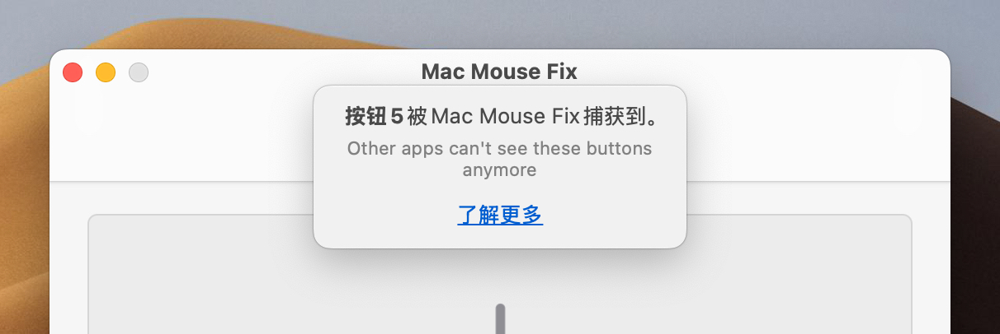
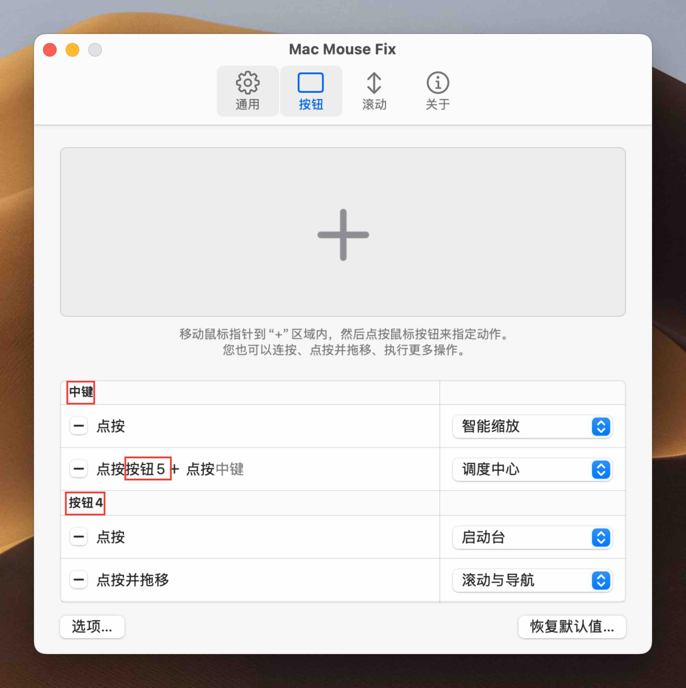
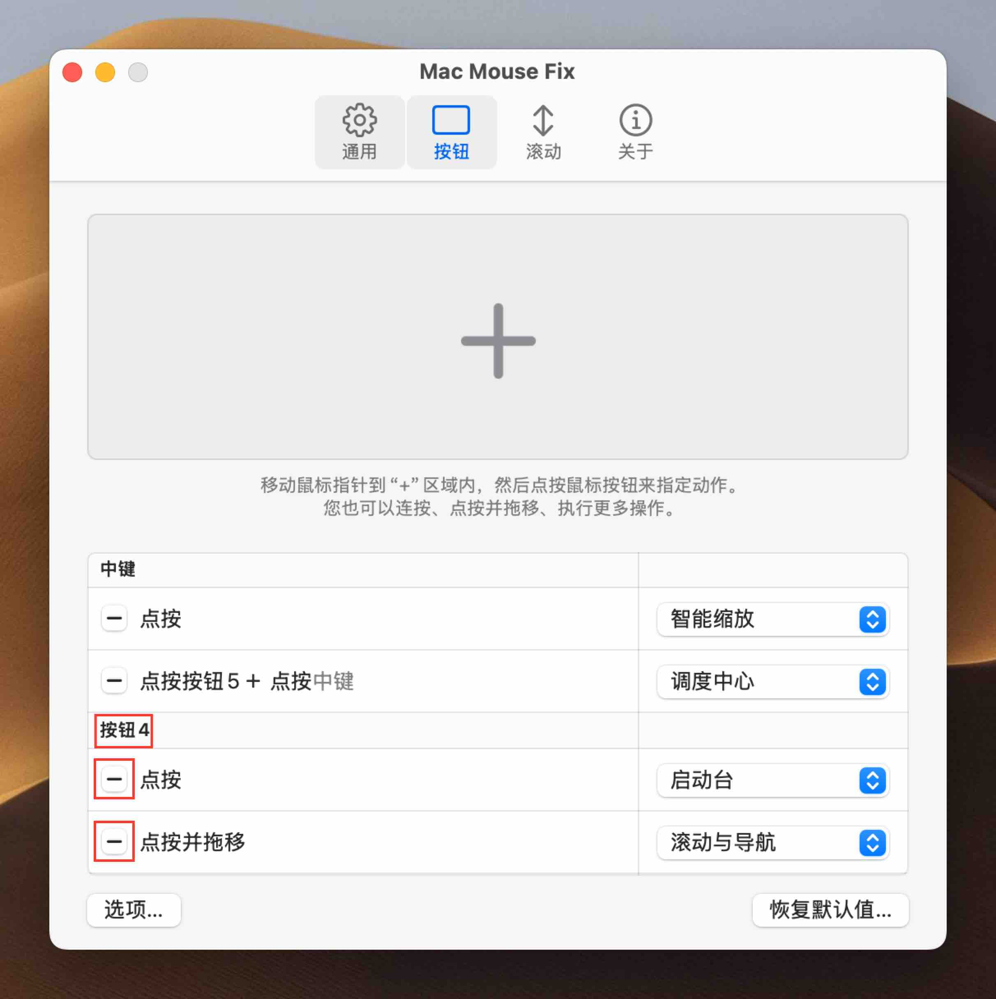

<!--
THIS FILE IS AUTOMATICALLY GENERATED - EDITS WILL BE OVERRIDDEN
-->

󠁧󠁿🇨🇳 中文 (简体)

  [🇬🇧 English](../../../../../Support/Guides/CapturedButtonsMMF3.md)\
  [🇩🇪 Deutsch](../../../../../Markdown/LocalizedDocuments/de/Support/Guides/CapturedButtonsMMF3.md)\
  [🇪🇸 Español](../../../../../Markdown/LocalizedDocuments/es/Support/Guides/CapturedButtonsMMF3.md)\
  [🇹🇷 Türkçe](../../../../../Markdown/LocalizedDocuments/tr/Support/Guides/CapturedButtonsMMF3.md)\
  [🇨🇿 Čeština](../../../../../Markdown/LocalizedDocuments/cs/Support/Guides/CapturedButtonsMMF3.md)\
  [🇷🇺 Русский](../../../../../Markdown/LocalizedDocuments/ru/Support/Guides/CapturedButtonsMMF3.md)\
  **🇨🇳 中文 (简体)**\
  [🌎 欢迎提供翻译贡献！](https://redirect.macmousefix.com/?locale=zh-Hans&target=mmf-localization-contribution)

<!--

Planning for updated MMF 3 Captured Buttons Guide: [Aug 2025]

- There are two aspects to the Guide:
    - Practical user problems caused by capturing
        - Helping people solve these are the core purpose of this Guide
        - List of practical problems I can think of
            - Terminal pasting, Browser-link-opening 
                - (Due to Middle Click capturing)
            - Blender orbiting 
                - (Due to Middle Drag capturing)
            - Browser back-and-forward 
                - (Due to Side-Button Capturing) 
                - (I don't remember actually hearing issue reports about this.)
            - Video-game remapping of side-buttons 
                - (Due to Side-Button Capturing) 
                - (Which videogames do that?)
            - Using MOS, Logi Options, or another smooth scrolling app for scrolling, and using MMF only for buttons
                - (Due to scrollwheel capturing) 
                - (Not sure if you need to fully uncapture to make this work – Can't you just turn off smooth-scrolling in MMF? But it would still be nice for users to know how to get MMF CPU usage during scrolling to 0% if they don't need it.)
    - Instilling fundamental mental model of how capturing works
        - If people understand this, they can then understand how to solve their specific practical problems. Maybe even ones we're not aware of.
        - This may make up the majority of the content, but it's **in service** of people being able to solve the practical problems.

Content:
    - Core explanation of 'capturing' 
        - should probably be shared for scrollwheel and buttons
        - ... But that might make it more abstract and harder to understand? 
    - Practical UI-based guides 'How do I know what is captured' and 'how to uncapture' 
        - should probably be specific to scrollwheel / buttons and should probably use screenshots so it's very easy-to-follow
    - Reference to practical problems (See above)
        - People with those practical problems should be naturally guided to this article and it should be clear that they need to read this to sole the problem.
            - Leading with the abstract explanations of what 'capturing' means might not make this obvious?
                - Maybe list the practical issues explicitly in a scannable way.
            - Think about the 'user journey' for people with those practical problems!
        - Also write about how people can solve those practical issues caused by capturing *without* uncapturing (e.g. Middle Click action, Scroll & Navigate for Orbiting, etc.)
            - I guess you could think of uncapturing as a bit of a nuclear/last resort option (?) (but useful to understand)
        - Probably pull in the Blender Orbiting section from Readme > Questions
            - Are there other sections we should pull in?
-->

<!-- 
    Philosophical: The current draft explains the reasoning and addresses the problem cases I'm aware of in great detail. The old version just tried to instill fundamental understanding of capturing and let users figure out their usecases (and mentions some problem-cases briefly at the end to say "here's how to solve this without uncapturing")

    Update: [Sep 2025] It seems we since went back to something closer to the old structure.

        New Philosophical thoughts: I think I program too much. I was too in my head with this. This isn't about making some technically perfect thing, it's just about helping people solve problems with the app.
-->

<!-- 

-->

<!--

# Captured Buttons

When you install Mac Mouse Fix, you'll notice that the **buttons on your mouse perform new functions**.

However, you may also notice that, some of the old **functions that those buttons used to perform no longer work**.

This may disrupt your workflow, if you previously used the buttons to:

- Click and Drag the middle button to **Orbit around objects in 3d modeling apps like Blender.**
- Click the middle button to **paste text in the Terminal**
- Click the middle button to **open links in a new tab in Safari and other browsers**
    - Click the middle button to **close tabs in Safari and other browsers**. 
        (Is this worth mentioning separately?)
- Click the side buttons (mouse button 4 and 5) to **go back and forward in Chrome, VSCode, and other apps.**
- Remapped the mouse buttons to **Custom assigned functions in video games or pro apps** (like ...? VSCode?).

The buttons will no longer perform their usual actions because the buttons have been **captured** by Mac Mouse Fix – that means Mac Mouse Fix takes **complete control** of those buttons and **other apps no longer get notified** when you press those buttons. (/ "can no longer see" those buttons.) 

Mac Mouse Fix needs to hide the button from other apps so that you can perform gestures and actions in Mac Mouse Fix without accidentally triggering functions on those other apps at the same time.

## What can I do to restore the functionality of a button before it was captured by MMF?

To get back the functionality that you were used to before installing Mac Mouse Fix, there are 3 approaches.

1. Leave the Button captured, but assign functionality inside MMF that restores the original functionality that you were used to.
2. Uncapture the button – if you delete **all the bindings** in MMF for a button, then that button will no longer be captured and will behave exactly as if Mac Mouse Fix was disabled
3. Disable Mac Mouse Fix entirely (Switch off `General > Enable Mac Mouse Fix`) – then MMF will not interfere with the functioning of your mouse at all.

### 1. Restoring old functionality – without uncapturing

 - Assign Click and Drag to 'Scroll & Navigate'. It will simulate trackpad-swiping with 2 fingers which lets you orbit in Blender among other things. However if your computer getting slow this might become less responsive (Working on that.)
    Solves usecases: 
        - **Orbit around objects in 3d modeling apps like Blender.**
        - **go back and forward in Chrome, VSCode, and other apps.**
- Assign Clicking to 'Middle Click' action in MMF.
    Solves usecases: 
        - **paste text in the Terminal**
        - **open links in a new tab in Safari and other browsers** 
            - and **close tabs in Safari and other browsers**
        - **Custom assigned functions in video games or pro apps**
            - Caveats: Only 'click' actions will work, not 'Click and Drag' actions – because MMF sends the mouseup and mousedown event at once. (Necessary to avoid interference with other MMF gestures assigned to the same button)
- Assign clicking to 'Back' and 'Forward' actions in MMF
    Solves usecases:
        - **go back and forward in Chrome, VSCode, and other apps.**
        - **Custom assigned functions in video games or pro apps**
            - Why this works? The 'Back' and 'Forward' actions will actually simulate MB 4/5 clicks in video games and pro apps (since MMF 3.0.6), so you can then remap MB 4/5 in those games/apps and it'll work.
            - Caveats: Only 'click' actions will work, not 'Click and Drag' actions – because MMF sends the mouseup and mousedown event at once. (Necessary to avoid interference with other MMF gestures assigned to the same button)

### 2. Restoring old functionality – by uncapturing

(Maybe insert the explanations of the fundamental capturing concepts from the old guide.)

-->

# 被捕获的鼠标按键

在使用 Mac Mouse Fix 时，你可能遇到过一条提示，称你鼠标上的某个按键正被 Mac Mouse Fix “捕获”。

"

在本文中，你将了解这一提示的含义、它可能导致的问题，以及如何解决这些问题。

## 什么是“捕获”鼠标按键？

一旦某个鼠标按键被 Mac Mouse Fix 捕获，其他应用程序或 macOS 系统将无法再识别到该按键的信号。
在该按键被捕获期间，它原本的功能将失效。

**示例**：通常情况下，你可以通过点击鼠标侧键（按键 4 和 5）在 Chrome 浏览器中执行“后退”或“前进”。
但当这些侧键被 Mac Mouse Fix 捕获后，原本的功能将不再生效。取而代之的是，侧键只会触发你在 Mac Mouse Fix 中为它们分配的动作。

**Mac Mouse Fix 为什么要这样做？** Mac Mouse Fix 对其他应用隐藏按键信号，是为了防止你在使用 Mac Mouse Fix 手势时意外触发其他功能。
例如，如果你通过“按住并拖动按键 4”来切换桌面，如果没有捕获机制，你在切换桌面的**同时**，Chrome 浏览器也会执行“后退一页”的操作。

## 我该如何知道哪些按键正被 Mac Mouse Fix 捕获？

任何显示在“按键”标签页左侧列表中的按键，都正处于被 Mac Mouse Fix 捕获的状态。

如下图所示，**“中键”**、**“按键 5”**以及**“按键 4”**已被捕获： 

"

## 如何防止 Mac Mouse Fix 捕获某个鼠标按键？

若要防止 Mac Mouse Fix 捕获某个鼠标按键，请从“按键”标签页中删除该按键的所有配置项。
你可以通过点击左侧的 **“-”** 按钮来删除“按键”标签页中的条目。

例如，在下图中，你可以通过点击高亮显示的两个 **“-”** 按钮，来防止 **“按键 4”** 被捕获：

"

## 如何恢复按键的原始功能？

若要让按键恢复到安装 Mac Mouse Fix 之前的行为模式，你可以采取以下几种方法：

1. **防止该按键被捕获** —— 具体操作如上文所述。

2. **直接关闭 Mac Mouse Fix** —— 这样所有的按键都不会被捕获。

3. **在 Mac Mouse Fix 中为该按键分配特定动作** —— 通过这种方式，即使在按键被捕获的情况下，你也可以恢复某些特定功能：

| 按键 | 原始功能 | 在Mac Mouse Fix中的功能 |
|----------|-----------------------------------|-------------------------|
| 中键 | 在浏览器的新标签中打开链接 | '按中键' （可分配至点击按键的动作） |
| 中键 | 在终端中粘贴 | '按中键' （可分配至点击按键的动作） |
| 按键 4 / 按键 5 | 在 Chrome 及其他应用中执行“后退/前进” | “后退” / “前进” （可分配至点击按键的动作） |
| 中键 | 在Blender（或其他3D软件）中围绕物体旋转 | “滚动与导航” （可分配至点击按键的动作） |

通过这种方式，你可以在保留按键原有功能的同时，还能在 Mac Mouse Fix 中为其分配“额外”的扩展功能。

## 另请参阅

- [被捕获的滚轮](<../../Support/Guides/CapturedScrollWheels.md>)

 

<table align="center">
<td>

希望这些信息对你有所帮助！</td>
<td>

还有其他疑问？请点击[这里](https://redirect.macmousefix.com/?locale=zh-Hans&target=mmf-support-still-have-questions)</td>
</table>

<!-- 
Should we add explanations / context for the table above?
- [ ] Maybe add screenshot of how to select the actions in MMF? (as in the MMF2 Guide.)
- [ ] Maybe explain how **'Zurück'** / **'Vorwärts'** simulate MB 4/5 clicks in third-party apps
- [ ] Maybe explain how **'Scrollen & Navigieren'** simulates 2-finger Trackpad swipes
-->

<!-- Hint: You can also assign the 'Middle Click' action to other any other trigger like 'Button 4 Hold' etc. Learn more about triggers in this guide -->